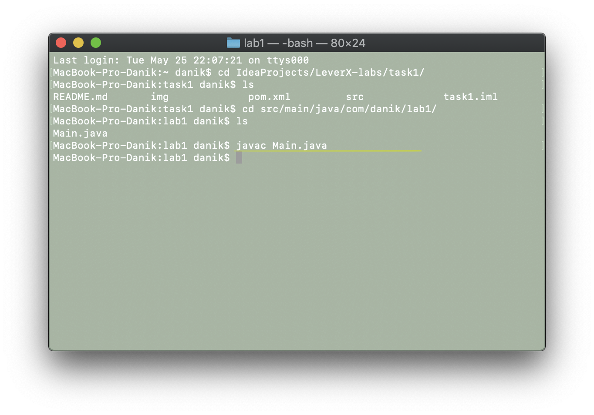

# Инструкция по сборке:
## создание .class с помощью javac
для того, чтобы создать файл с расширенинем `.class`, мы используем javac:
1. в терминале зайти в папку с файлом `Main.java` и выполнить команду *javac Main.java*
это простейшая компиляция без занесения в директорию `target`

