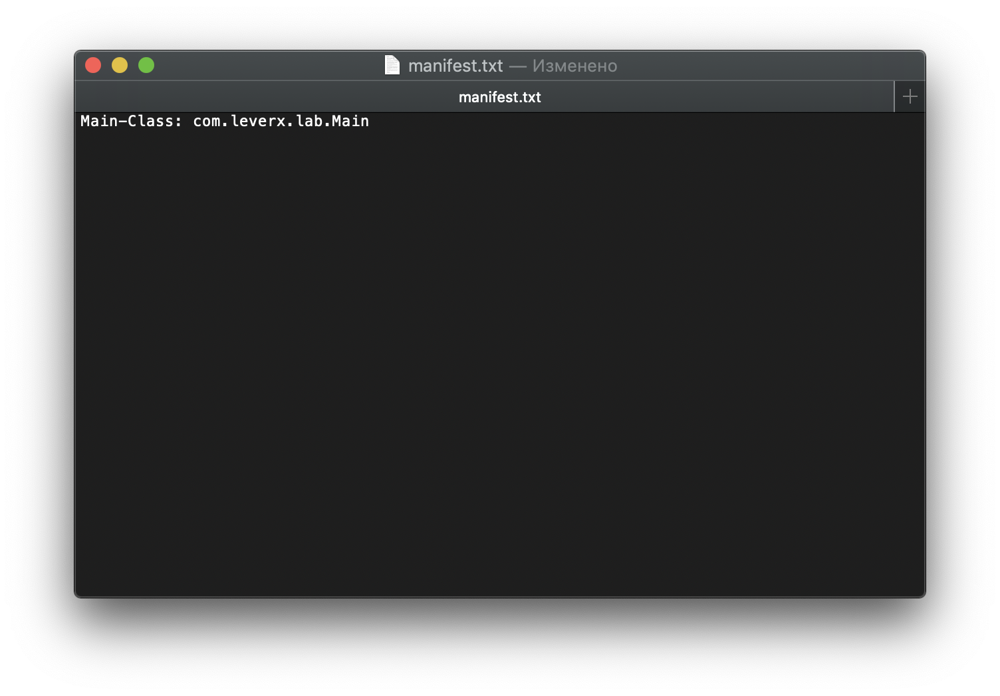

# Instruction for building:
## Creation .class and running with java
* For creation  `.class`, we use javac:
* In terminal from directory with `Main.java` file use command *javac Main.java*

* We can run this program from console with `java package1.package2.package3.Main` command from root directory.

## Building .jar and running this from console
*  After that we need to build `.jar` in addition to class file `package1/package2/package3/*.class`.
You must to add `Main-Class` into `MANIFEST.MF` which is located in `META-INF`. 
For that we can create `.txt` file with line that contains `Main-Class` which we need to add to `MANIFEST.MF`.

    `file should be ended with new line`

* We can create `.jar` in root directory with `jar cfm main.jar manifest.txt com/leverX/lab1/*.class` command
which will create new jar with merged line from `manifest.txt` with `MANIFEST.MF`.
* And than run it from terminal

* You can see `META-INF` directory with its content by using `jar xf main.jar` command to check if the  file is correct.
## Compiling and running .jar with libraries
* Firstly we can download library, for example `commons-math-20040218.045431.jar`.
To compile we need to add option `-cp` or `-classpath` with path to library like I do below:

* We must add this library to `CLASSPATH` by using command `export CLASSPATH=$CLASSPATH:path/to/.jar`:

* We can run this program from root directory like we did in the first part without libraries:

* Now to create correct `main.jar` we need to change `MANIFEST.MF` by changing created before `manifest.txt` and merging it during creating `main.jar`.
`manifest.txt` looks like on thee screen below (was added `Class-Path` with path to the library):

* Then we can create `main.jar`, but we need to change a few details:
* * like we did before with adding `com/levrx/lab/Main.class` in the end of command we need to add path to the library

* Like you can see above we can run program from jar `main.jar` using additional libraries
