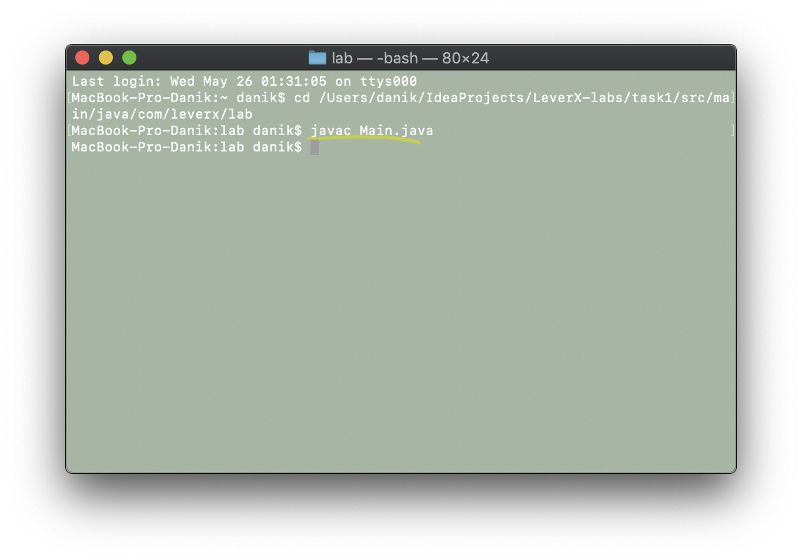
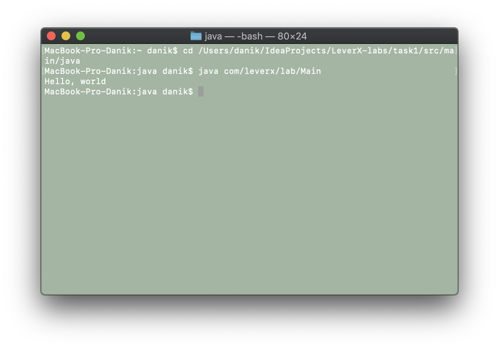
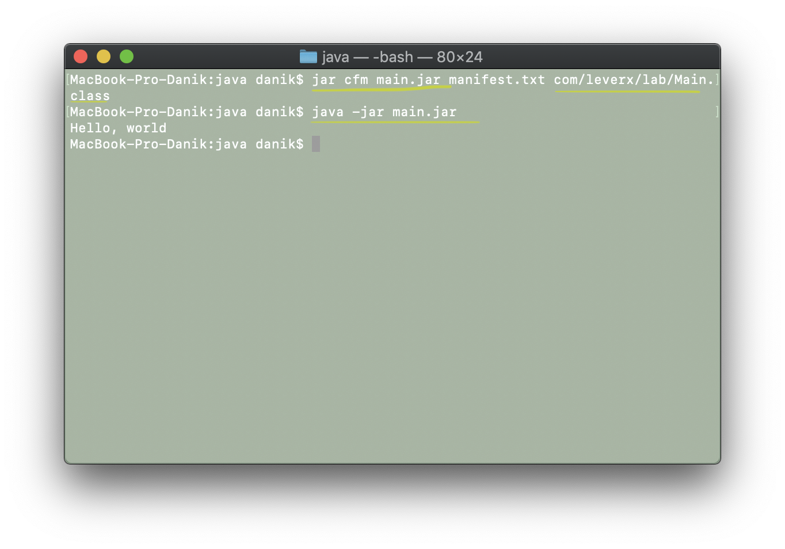

# Инструкция по сборке:
## Создание .class и запуск с помощью javac
* для того, чтобы создать файл с расширенинем `.class`, мы используем javac:
* В терминале зайти в папку с файлом `Main.java` и выполнить команду *javac Main.java*
это простейшая компиляция без занесения в директорию `target`

* Мы можем запустить программу из конcоли с помощью команды `java package1.package2.package3.Main` из `!!!`родительского каталога`!!!`

## Создание .jar и запуск из консоли
*  Затем необходимо в родительском каталоге создать `.jar` c добавлением файла класса `package1/package2/package3/*.class`.
Но для того, чтоб всё работало, нам необходимо задать `Main-Class` в `MANIFEST.MD`. 
Для этого мы создадим файл `.txt` со строкой, которую мы хотим добавить в `MANIFEST.MD`

    `обязательно файл должен заканчиваться переходом на новую строку, иначе не будет работать.`

* после того, как мы всё подготовили, мы можем создать `.jar` в родительском каталоге с помощью команды `jar cfm main.jar manifest.txt com/leverX/lab1/*.class`, 
которая создаст джарник и сделает слияние содержимого файла `manifest.txt` с `MANIFEST.MD`

* Содержимое джарника можно посмотреть с помощью команды `jar xf main.jar`, и там залезть в `META-INF`
* После создания джарника с указанием всего необходимого мы  можем запустить программу из родительской директории

### Дополнения:
1. на всякий случай `manifest.txt` добавлен в родительский каталог
2. в папке `img` лежат изображения-примеры
